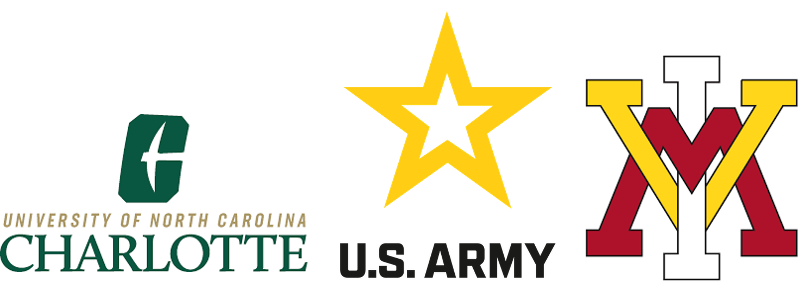

# Colby Lalicker 

 

## About Me

Currently a Student at UNCC Studying Computer Science graduating in December 2024. I served in the US Army for 4 years as an Infantry Officer within the 101st ABN DIV. 

Some hobbies of mine include running, cycling, and disc golf (although i'm not very good).

Factoid about me is that I've climbed Mt. Fuji in 2018 during a two week trip in Japan.

#### **University of North Carolina (UNCC)** Charlotte, NC

Bachelor of Science in Computer Science

Concentration: Software, Systems, and Networks

| Honors: Chancellor's List | GPA: 4.0 | Grad: DEC 2024 |

---

#### **Virginia Military Institute (VMI)** Lexington, VA

Bachelor of Science in Civil Engineering

| Honors: Dean's List | With Distinction | Distinguished Military Graduate |

GPA: 3.4 | Grad: MAY 2018

#### Awards (2018-2022)
- ARMY COMMENDATION MEDAL
- NATIONAL DEFENSE SERVICE MEDAL
- GLOBAL WAR ON TERRORISM SERVICE MEDAL
- HUMANITARIAN SERVICE MEDAL
- ARMY SERVICE RIBBON
- EXPERT INFANTRYMAN BADGE
- PARACHUTIST BADGE
- AIR ASSAULT BADGE
- LACROSSE HIGH SCHOOL ALL-AMERICAN (2013)

## Skills
**Languages:** Java, Python, MySQL, C, C++, HTML, Markdown, Assembly RISC-V, Rust, JavaScript, Structured Text, Ladder Box Diagrams

**Tools:** GitHub, Junit, Visual Studio Code, IntelliJ IDEA, NetBeans, Anaconda, Excel, GIS, WireShark, Pandas, PyTorch, Scikit-Learn, TwinCAT, DataBricks, Inductive Ignition, Programmable Logic Controllers/Sensors

**OS:** Windows/Linux

## Professional Experience
### Corning | Hickory, NC (2024)
#### **Digital Transformation Intern**
- Work closely with experienced PLC and SCADA engineers to develop proof of concept for new technologies such as IoT Sensors, SCADA configurations, andvanced analytics and machine learning to collect and analyze real-time data from manufacturing operations.
- Utilize industry 4.0 technologies within a fiber optics manufactyuring plant to prepare solutions to automate data collection in order to create a faster, safer, and more reliables production line.
  
### The United States Army | Fort Campbell, KY (2019-2022)
#### **Operations Manager (Company Executive Officer)**
- Provided management of roughly $100M worth of equipment utilizing data management software for the department leadership, ensuring all documentation and monthly inventories are upheld.
- Prioritized, planned, and coordinated training for over 100 personnel within the organization, ensuring seamless logistics for meals, equipment, and reserved land for training requirements.

#### **Department Supervisor (Heavy Weapons Company Platoon Leader)**
- In charge of the health and welfare of 7,000 Afghan Refugees at Fort Pickett, VA during the Humanitarian Mission of Operation Allies Welcome.
- Directed and supervised 24 service members, overseeing Heavy Weapons Systems, and managing assets totaling $12 million. Simultaneously led comprehensive planning for all platoon field and physical training initiatives, ensuring precision, efficiency, and mission readiness.

#### **Program Mangager (Battalion Assistant Operations Officer)**
- Optimized Email Communication: Leveraged a custom distribution list for key correspondence, enhancing efficiency and Impact.
- Aided in the development and coordination of department-level training and exercises, actively participating in planning and scheduling as required.

## Projects

**1. Programming Languages: Weather Discord Bot (Python)**
  - Collaborated with a team of students to utilize Python, Serenity Framework, and the Discord API
to create a publicly available bot that provides various weather data such as overview,
temperatures, and cloud coverage for most cities and towns across the globe
  - Tested connections from local machine to Discord and hosting site to Discord throughout the
project documenting results to ensure the optimal solution was used

[Discord BOT](https://github.com/ColbyDL/weather_bot)

**2. Software Engineering: Online Food Ordering API (Python)**
  - Utilized FastAPI and MySQL to create an online food ordering API providing functionality for
customer ordering and owner management
  - Established connection between MySQL workbench and the FastAPI documentation web page to
ensure accurate updates to the database

[Online Food Ordering API](https://github.com/ColbyDL/Group-8_ITSC3155-FinalProjectv2/tree/main/FinalProject)

**3. Intro to Networks 3166 - Socket Programming TCP/UDP (Python)**
  - In this project, I demonstrate how to establish a connection between a client and server utilizing TCP and UDP.
  - Python is used to program the connections while wireshark captures the messages sent and received.

## Goals and Objectives

#### Career 
Current aspirations are to work within Backend or Networking upon graduation from UNCC. 

#### Current Goals
- Currently working on a Video Game that will be a recreation of MineSweeper with the engine Godot. (Will have link for github soon)
- Working and Studying towards CompTIA Security+ Certification.
- Century Cycling Ride

<!--
**ColbyDL/ColbyDL** is a ✨ _special_ ✨ repository because its `README.md` (this file) appears on your GitHub profile.

Here are some ideas to get you started:

- 🔭 I’m currently working on ...
- 🌱 I’m currently learning ...
- 👯 I’m looking to collaborate on ...
- 🤔 I’m looking for help with ...
- 💬 Ask me about ...
- 📫 How to reach me: ...
- 😄 Pronouns: ...
- ⚡ Fun fact: ...
-->
